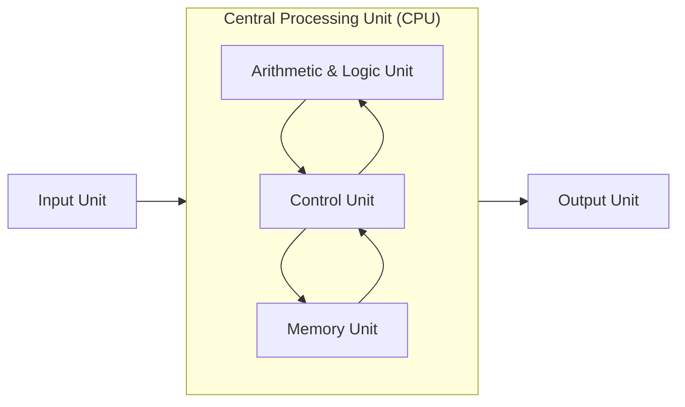
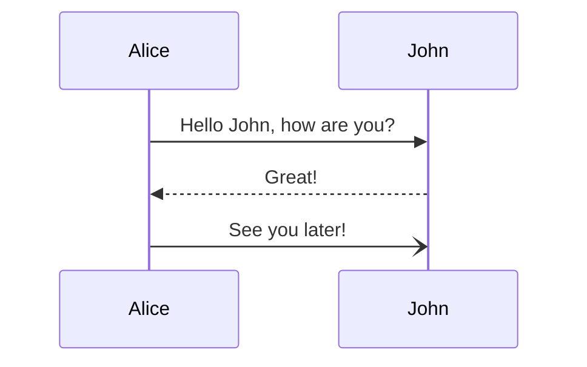
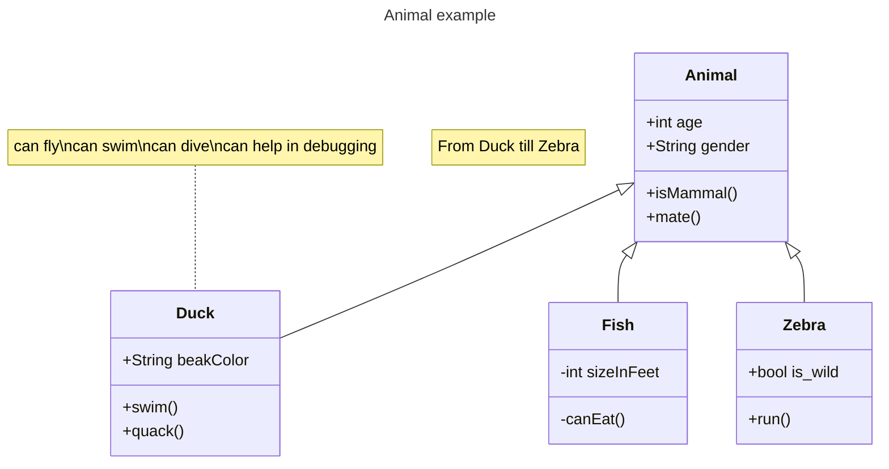

# Using Mermaid to Generate Cool Diagrams from Text

You can directly generate your diagrams inside the markdown file provided that you have a mermaid plugin installed in your platform or IDE.
Here an example of a block diagram that is also listed in the medium article related to this repository.


The code generate the previous diagram is as follows:\
Code:
```Mermaid
flowchart LR
    subgraph CPU["Central Processing Unit (CPU)"]
        direction TB
        ArithmeticUnit["Arithmetic & Logic Unit"]
        ControlUnit["Control Unit"]
        MemoryUnit["Memory Unit"]
        
        ArithmeticUnit-->ControlUnit-->ArithmeticUnit
        MemoryUnit-->ControlUnit-->MemoryUnit
    end
    InputUnit["Input Unit"]-->CPU 
    CPU-->OutputUnit["Output Unit"]
```

The diagrams that can be plotted vary from the simple block diagrams up to more advances diagrams like UML classes or sequence diagrams. Here is a list of some diagrams that can be found on the official website of mermaid. https://mermaid.js.org/ for detailed tutorials and sample code https://mermaid.js.org/ecosystem/tutorials.html
For each example, the code in mermaid syntax will be displayed before its generated diagram.\
Code:
```Mermaid
sequenceDiagram
    Alice->>John: Hello John, how are you?
    John-->>Alice: Great!
    Alice-)John: See you later!


```
Diagram:

This is an example of a script that can be used to describe the relationship between different classes using UML class diagram. 

Code:
```Mermaid
---
title: Animal example
---
classDiagram
    note "From Duck till Zebra"
    Animal <|-- Duck
    note for Duck "can fly\ncan swim\ncan dive\ncan help in debugging"
    Animal <|-- Fish
    Animal <|-- Zebra
    Animal : +int age
    Animal : +String gender
    Animal: +isMammal()
    Animal: +mate()
    class Duck{
        +String beakColor
        +swim()
        +quack()
    }
    class Fish{
        -int sizeInFeet
        -canEat()
    }
    class Zebra{
        +bool is_wild
        +run()
    }

```
Diagram:

